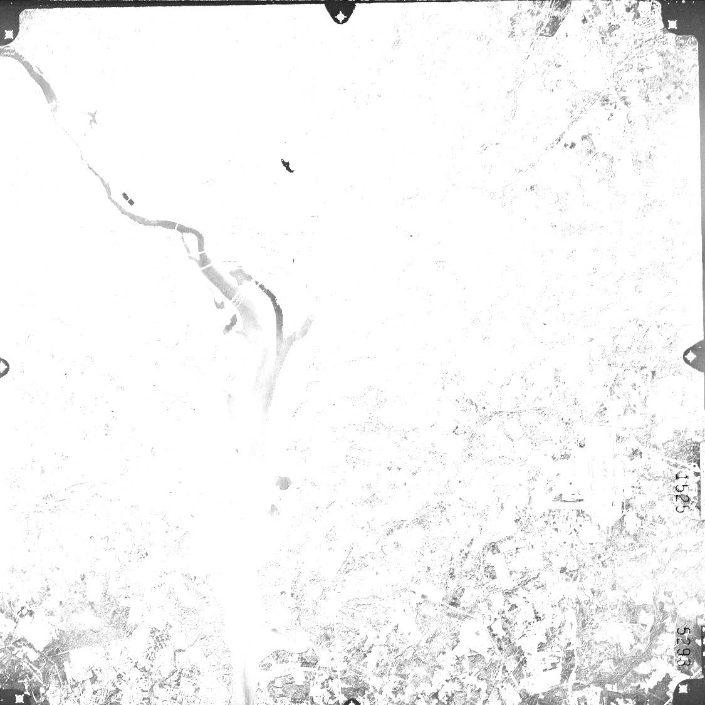

# Autoencoder CNN Layer
## What does this project do
This project implements an Autoencoder with a single encoder and decoder layer using Cuda kernels for educational purposes. The training procedure uses finite differences to compute the gradients for simplicity.

## How to build and run
1. Clone the repo and change into the cloned directory
2. Create a build directory and change into it
3. Adjust the follwing lines in the CMakeLists.txt to the correct paths of yout system and set the compute capability of your Cuda device
```
set(CMAKE_CUDA_COMPILER your/path/to/nvcc)
set(CMAKE_CUDA_TOOLKIT_INCLUDE_DIRECTOR your/path/to/cuda/include)
set(CMAKE_CUDA_RUNTIME_LIBRARY your/path/to/libcudart.so)

set(CMAKE_CUDA_ARCHITECTURES [your architecture compute capability])
```
4. Run cmake and compile
```
cmake ..
make
```

5. Install python libraries:
```
pip install -r requirements.txt
```

6. Change into the root folder and run:
```
python autoencoder.py
```

## Progress of encoder feature extraction after 10 epochs of training
#### Original image

<table>
  <tr>
    <th>Epoch 1</th>
    <th>Epoch 2</th>
    <th>Epoch 3</th>
    <th>Epoch 4</th>
    <th>Epoch 5</th>
  </tr>
  <tr>
    <td></td>
    <td></td>
    <td></td>
    <td></td>
    <td></td>
  </tr>
  <tr>
    <th>Epoch 6</th>
    <th>Epoch 7</th>
    <th>Epoch 8</th>
    <th>Epoch 9</th>
    <th>Epoch 10</th>
  </tr>
  <tr>
    <td></td>
    <td></td>
    <td></td>
    <td></td>
    <td></td>
  </tr>
</table>
